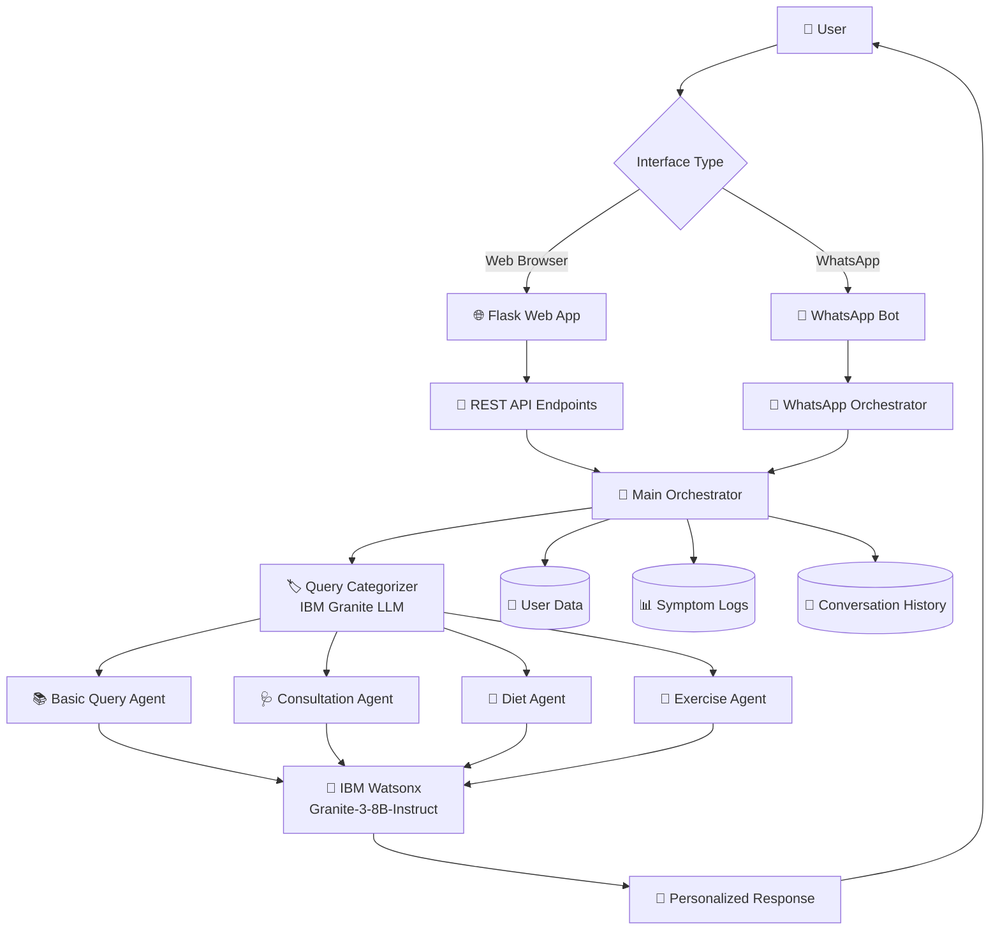
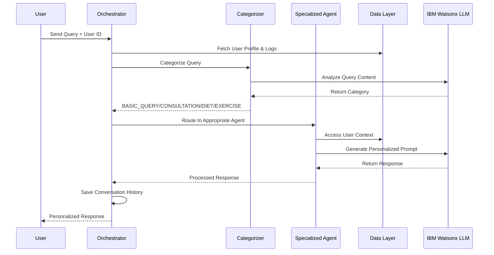

# Bloom - Menopause Health & Wellness Assistant 🌸

## Overview

Bloom is an intelligent multi-agent conversational AI system designed to provide comprehensive support for women navigating menopause. Built using IBM Watsonx and powered by the Granite-3-8B-Instruct model on IBM Cloud, Bloom offers personalized guidance across four specialized domains: general menopause education, health consultations, diet & nutrition, and exercise & fitness.

The system features a sophisticated multi-agent architecture where an orchestrator intelligently routes user queries to specialized agents, ensuring users receive expert-level, contextual responses tailored to their specific needs and health profiles.

## Key Features

### 🤖 **Multi-Agent Intelligence**
- **Smart Query Routing**: Orchestrator analyzes queries and routes them to the most appropriate specialized agent
- **Contextual Awareness**: Maintains conversation history and user context across interactions
- **Personalized Responses**: Leverages user profiles and symptom logs for tailored recommendations

### 🩺 **Specialized Health Domains**
- **Basic Query Agent**: General menopause education, symptoms, stages, and informational content
- **Consultation Agent**: Medical advice, symptom analysis, treatment recommendations, and health guidance
- **Diet Agent**: Nutrition recommendations, meal planning, supplements, and dietary management
- **Exercise Agent**: Fitness routines, physical activity recommendations, and wellness programs

### 📱 **Multi-Platform Access**
- **Web Interface**: Clean, responsive web application with real-time chat functionality
- **WhatsApp Integration**: Seamless conversational experience through Twilio WhatsApp API
- **RESTful API**: Comprehensive endpoints for each specialized agent

### 🔐 **Data-Driven Personalization**
- **User Profiles**: Age, health conditions, medications, lifestyle factors
- **Symptom Tracking**: Comprehensive logging of menopause symptoms and patterns
- **Conversation Memory**: Context-aware responses based on interaction history

## Architecture

### System Overview
Bloom employs a sophisticated multi-agent architecture with intelligent orchestration, built on IBM Watsonx's Granite model for natural language understanding and generation.



### Agent Architecture Flow



## User Interface 
<p align="center">
  
  
  
  
</p>

### Core Components

1. **Orchestrator Engine**: Central intelligence hub that manages query routing and context
2. **Query Categorization**: LLM-powered classification system for intelligent agent selection
3. **Specialized Agents**: Domain-expert agents with focused knowledge bases
4. **Data Integration Layer**: User profiles, symptom tracking, and conversation memory
5. **IBM Watsonx Integration**: Advanced language model for natural conversation
6. **Multi-Channel Interface**: Web and WhatsApp connectivity

## IBM Technologies Used

Bloom leverages several key IBM technologies to provide intelligent menopause health assistance:

### 🧠 **IBM Watsonx Platform**
- **Location**: Core LLM integration across all agents (`agents/orchestrator.py`, `agents/basic_query.py`, `agents/consultation.py`, `agents/diet.py`, `agents/exercise.py`)
- **Usage**: Powers natural language understanding, query categorization, and response generation
- **Model**: Granite-3-8B-Instruct for conversational AI capabilities
- **Configuration**: Centralized LLM setup with optimized parameters for menopause domain expertise

### 🤖 **IBM Granite-3-8B-Instruct Model**
- **Primary Function**: Advanced language model for generating contextual, personalized responses
- **Implementation**: 
  - Query categorization and intelligent routing
  - Personalized health advice generation
  - Conversation context understanding
  - Medical terminology and menopause expertise
- **Parameters**: Optimized with low temperature (0.1) for consistent, reliable health advice

### ⚡ **IBM Watson Machine Learning**
- **Location**: Model parameter configuration and deployment management
- **Usage**: 
  - Fine-tuned generation parameters (`GenParams.DECODING_METHOD`, `GenParams.TEMPERATURE`)
  - Token management for response optimization
  - Stop sequences for clean response formatting
- **Integration**: Seamless model serving and inference through IBM's ML platform

### 🔗 **LangChain-IBM Integration**
- **Purpose**: Bridge between Bloom's multi-agent architecture and IBM Watsonx services
- **Components**:
  - `WatsonxLLM`: Direct integration with IBM's language models
  - `WatsonxEmbeddings`: Vector embeddings for semantic understanding
  - Memory management for conversation context
- **Benefits**: Standardized interface for IBM AI services with enterprise-grade reliability

### 📊 **IBM Watsonx.ai Foundation Models**
- **Model Selection**: Granite-3-8B-Instruct chosen for:
  - Medical domain understanding
  - Instruction-following capabilities
  - Personalization and context awareness
  - Responsible AI guardrails
- **Deployment**: Cloud-based inference with API key authentication
- **Scalability**: Enterprise-grade infrastructure for multiple concurrent users

### 🛡️ **IBM Watson Machine Learning Security**
- **Authentication**: API key-based secure access to IBM services
- **Data Protection**: Encrypted communication with IBM cloud infrastructure
- **Compliance**: IBM's enterprise security standards for healthcare applications
- **Environment Management**: Secure credential handling through environment variables

### ☁️ **IBM Cloud Infrastructure**
- **Data Storage**: Secure cloud-based storage for user profiles and health data
- **Usage**:
  - User data management (`data/userData.csv`, `data/user_data.json`)
  - Symptom logging and tracking (`data/userLogData.csv`)
  - Conversation history persistence
  - Real-time data synchronization across platforms
- **Benefits**: 
  - Enterprise-grade security and compliance
  - Scalable storage infrastructure
  - High availability and data redundancy
  - HIPAA-compliant data handling for healthcare applications
- **Integration**: Seamless connectivity with Watsonx services for unified data access

## WhatsApp Feature

### 📱 Conversational WhatsApp Experience
Bloom extends its intelligence to WhatsApp through Twilio integration, offering users a familiar and accessible platform for menopause support.

#### Key WhatsApp Capabilities:
- **Intelligent Conversation Flow**: Guides users through symptom collection for personalized advice
- **Symptom Memory**: Saves user symptoms for future interactions, eliminating repetitive data entry
- **Smart Query Processing**: Automatically detects basic queries vs. personalized consultation needs
- **Session Management**: Maintains conversation context and user state across interactions
- **Message Optimization**: Automatically truncates long responses to fit WhatsApp limits

#### WhatsApp Workflow:
1. **Welcome & Onboarding**: Users receive guided introduction to Bloom's capabilities
2. **Symptom Collection**: For consultation/diet/exercise queries, collects user symptoms once
3. **Intelligent Routing**: Routes queries to appropriate agents with symptom context
4. **Persistent Memory**: Remembers user symptoms and preferences for future interactions
5. **Update Mechanism**: Users can update symptoms anytime using natural commands

#### WhatsApp Commands:
- `hi/hello/start` - Welcome message and introduction
- `menu/options` - Display available services
- `update symptoms` - Refresh saved symptom information
- Direct questions - Automatic routing to appropriate agents

## File Structure

```
Bloom-AI/
├── app.py                        # Main Flask application with REST endpoints
├── README.md                     # Project documentation
├── requirements.txt              # Python dependencies
│
├── agents/                       # Core AI agent modules
│   ├── basic_query.py           # General menopause information agent
│   ├── consultation.py          # Medical consultation agent
│   ├── diet.py                  # Nutrition and diet agent
│   ├── exercise.py              # Fitness and exercise agent
│   └── orchestrator.py          # Main orchestration engine
│
├── data/                         # User data and configuration
│   ├── url.json                 # Configuration URLs
│   ├── user_data.json           # JSON user data format
│   ├── userData.csv             # User profiles and demographics
│   └── userLogData.csv          # Symptom logs and tracking data
│
├── frontend/                     # Next.js frontend application
│   ├── components.json          # shadcn/ui component configuration
│   ├── next-env.d.ts           # Next.js TypeScript declarations
│   ├── next.config.ts          # Next.js configuration
│   ├── package.json            # Frontend dependencies
│   ├── postcss.config.mjs      # PostCSS configuration
│   ├── tailwind.config.ts      # Tailwind CSS configuration
│   ├── tsconfig.json           # TypeScript configuration
│   │
│   ├── docs/                   # Frontend documentation
│   │   └── blueprint.md        # Frontend architecture blueprint
│   │
│   └── src/                    # Frontend source code
│       ├── app/                # Next.js app router pages
│       │   ├── favicon.ico     # Site favicon
│       │   ├── globals.css     # Global CSS styles
│       │   ├── layout.tsx      # Root layout component
│       │   ├── page.tsx        # Home page
│       │   ├── ai-chat/        # AI chat interface
│       │   ├── calendar/       # Calendar functionality
│       │   ├── consultation/   # Consultation interface
│       │   ├── home/          # Home dashboard
│       │   ├── profile/       # User profile management
│       │   ├── register/      # User registration
│       │   ├── reports/       # Health reports
│       │   └── settings/      # Application settings
│       │
│       ├── components/         # Reusable React components
│       │   ├── app-layout.tsx  # Main application layout
│       │   ├── blog-card.tsx   # Blog post cards
│       │   ├── insight-card.tsx # Health insight cards
│       │   └── ui/            # UI component library (shadcn/ui)
│       │
│       ├── hooks/              # Custom React hooks
│       │   ├── use-mobile.tsx  # Mobile device detection
│       │   └── use-toast.ts    # Toast notifications
│       │
│       ├── img/                # Image assets
│       │
│       ├── lib/                # Utility libraries
│       │   ├── api.ts          # API client functions
│       │   ├── data.ts         # Data management utilities
│       │   ├── types.ts        # TypeScript type definitions
│       │   └── utils.ts        # General utility functions
│       │
│       └── types/              # TypeScript type declarations
│           └── jsx.d.ts        # JSX type extensions
│
├── templates/                    # Legacy web interface templates
│   └── index.html               # Basic HTML interface
│
└── whatsapp_connection/          # WhatsApp integration module
    ├── __init__.py              # Package initialization
    ├── whatsapp_connection.py   # Main WhatsApp bot implementation
    └── whatsapp_orchestrator.py # WhatsApp-specific orchestration
```

## Installation & Setup

### Prerequisites
- Python 3.8+
- IBM Watsonx Account and API credentials
- Twilio Account (for WhatsApp features)
- Flask web framework

### Environment Variables
Create a `.env` file with the following configurations:

```env
# IBM Watsonx Configuration
URL=your_watsonx_url
API_KEY=your_watsonx_api_key
PROJECT_ID=your_watsonx_project_id

# Twilio WhatsApp Configuration
TWILIO_ACCOUNT_SID=your_twilio_account_sid
TWILIO_AUTH_TOKEN=your_twilio_auth_token
TWILIO_WHATSAPP_NUMBER=your_twilio_whatsapp_number
```

### Installation Steps

1. **Clone the repository**
   ```bash
   git clone https://github.com/NIKITA320495/Bloom.git
   cd Bloom
   ```

2. **Install dependencies**
   ```bash
   pip install -r requirements.txt
   ```

3. **Configure environment variables**
   ```bash
   cp .env.example .env
   # Edit .env with your credentials
   ```

4. **Run the application**
   ```bash
   python app.py
   ```

## API Endpoints

### Core Endpoints
- **GET /** - Main web interface
- **POST /chat** - General queries with intelligent routing
- **POST /basicquery** - Direct basic query processing
- **POST /consultation** - Medical consultation queries
- **POST /diet** - Nutrition and diet queries
- **POST /exercise** - Fitness and exercise queries

### WhatsApp Endpoints
- **POST /whatsapp** - Twilio webhook for incoming messages
- **POST /whatsapp/send** - Send messages programmatically
- **POST /whatsapp/register** - Register user profiles

### Request Format
```json
{
  "user_id": "user123",
  "query": "What exercises are good for menopause?"
}
```

### Response Format
```json
{
  "user_id": "user123",
  "query": "What exercises are good for menopause?",
  "response": "Based on your profile, I recommend...",
  "category": "EXERCISE",
  "status": "success"
}
```

## Technology Stack

- **Backend**: Flask (Python)
- **AI/ML**: IBM Watsonx, Granite-3-8B-Instruct Model
- **Framework**: LangChain for AI orchestration
- **IBM Integration**: LangChain-IBM, IBM Watson Machine Learning
- **WhatsApp**: Twilio API integration
- **Data Storage**: CSV files (expandable to databases)
- **Frontend**: HTML/CSS/JavaScript
- **Deployment**: Python WSGI compatible

## Usage Examples

### Web Interface
1. Navigate to `http://localhost:5000`
2. Enter your user ID and query
3. Receive personalized responses from specialized agents

### API Usage
```python
import requests

# Example consultation query
response = requests.post('http://localhost:5000/consultation', json={
    "user_id": "user123",
    "query": "I'm experiencing severe hot flashes. What can I do?"
})

print(response.json())
```


### WhatsApp Integration
1. Send a message to your Twilio WhatsApp number
2. Follow the guided conversation flow
3. Receive personalized menopause guidance

### 👥 Team  
This application was collaboratively built by
[Nikita Babbar](https://www.linkedin.com/in/nikita-babbar-b0291026a/), 
[Manya Joshi](https://www.linkedin.com/in/manya-joshi-ai/), 
[Ritwick Johari](https://www.linkedin.com/in/ritwick-johari/),
[Piyush Singh](https://www.linkedin.com/in/piyushhh-singhh/).


